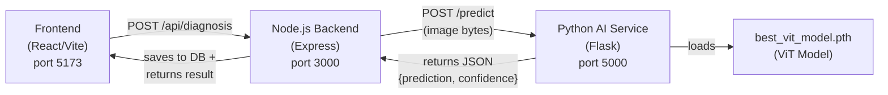

# 🐾 Connecting `best_vit_model.pth` to PawLens

## Architecture Overview

Your app now uses a **two-service architecture**:



## What Changed

| File | What Changed |
|------|-------------|
| [app.py](file:///Users/erroldmello/Documents/college/PawLens/pawlensai/app.py) | **New** — Flask microservice that loads `best_vit_model.pth` and exposes a `/predict` endpoint |
| [requirements.txt](file:///Users/erroldmello/Documents/college/PawLens/pawlensai/requirements.txt) | **New** — Python dependencies for the Flask service |
| [diagnosis.controller.js](file:///Users/erroldmello/Documents/college/PawLens/backend/src/controllers/diagnosis.controller.js) | **Updated** — Replaced random simulation with a real HTTP call to the Python AI service. Disease info keys now match model's 6 classes |

> [!IMPORTANT]
> The old controller was **randomly picking** a disease. Now it sends the uploaded image to the Python service and gets a **real prediction** from your trained ViT model.

## How to Run It

### Step 1: Install Python Dependencies

```bash
cd pawlensai

# Use your existing venv or create a new one
python3 -m venv roboflowvenv
source roboflowvenv/bin/activate

pip install -r requirements.txt
```

> [!NOTE]
> You likely already have `torch`, `timm`, and `Pillow` installed in your `roboflowvenv` since you used them for training. You just need to add `flask` and `flask-cors`.

### Step 2: Start the Python AI Service

```bash
cd pawlensai
source roboflowvenv/bin/activate
python app.py
```

You should see:
```
Loading model from /path/to/best_vit_model.pth on cpu...
Model loaded successfully!
Starting PawLens AI service on port 5000...
```

### Step 3: Start the Node.js Backend (in a separate terminal)

```bash
cd backend
npm run dev
```

### Step 4: Start the Frontend (in a third terminal)

```bash
cd frontend
npm run dev
```

### Step 3: Test the Flow

1. Open the app at `http://localhost:5173`
2. Upload a dog skin image via the diagnosis feature
3. The image goes: **Frontend → Node.js Backend → Python AI Service → Model Prediction → Back to Frontend**

## How the Prediction Flow Works

1. **User uploads image** in the frontend
2. **Node.js backend** receives the image via `multer` (memory storage)
3. Backend **uploads the image to ImageKit** for permanent storage
4. Backend **forwards the image buffer** to Flask's `/predict` endpoint
5. Flask service:
   - Opens the image with PIL
   - Applies the same transforms used during training (resize 224×224, normalize)
   - Runs inference through the ViT model
   - Returns predicted class + confidence + all probabilities
6. Backend **maps** the model's class name (e.g. `"demodicosis"`) to detailed disease info (description, symptoms, treatment, severity)
7. Backend **saves the diagnosis** to MongoDB and returns it to the frontend

## Model Classes → Disease Info Mapping

| Model Output | Display Name | Severity |
|-------------|-------------|----------|
| `demodicosis` | Demodicosis (Demodectic Mange) | High |
| `dermatitis` | Bacterial Dermatitis | Medium |
| `fungal_infections` | Fungal Infections | Medium |
| `healthy` | Healthy | Low |
| `hypersensitivity` | Hypersensitivity Allergic Dermatosis | Medium |
| `ringworm` | Ringworm (Dermatophytosis) | Medium |

## Quick Test (AI Service Only)

You can test the Python service directly with `curl`:

```bash
curl -X POST http://localhost:5000/predict \
  -F "image=@path/to/dog_skin_image.jpg"
```

Expected response:
```json
{
  "success": true,
  "prediction": "hypersensitivity",
  "confidence": 92.15,
  "probabilities": {
    "demodicosis": 1.23,
    "dermatitis": 2.45,
    "fungal_infections": 0.87,
    "healthy": 1.12,
    "hypersensitivity": 92.15,
    "ringworm": 2.18
  }
}
```

## Environment Variables (Optional)

| Variable | Default | Where | Purpose |
|----------|---------|-------|---------|
| `AI_PORT` | `5000` | `pawlensai/.env` | Port for the Flask AI service |
| `AI_SERVICE_URL` | `http://localhost:5000` | `backend/.env` | URL the Node.js backend uses to reach the AI service |

> [!TIP]
> For production deployment, you'd typically containerize both services with Docker and use a reverse proxy (like Nginx) in front of them. The `AI_SERVICE_URL` env var makes this easy to configure.
